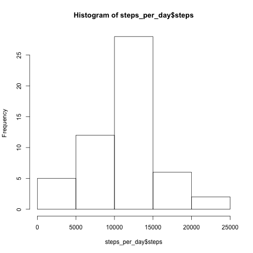
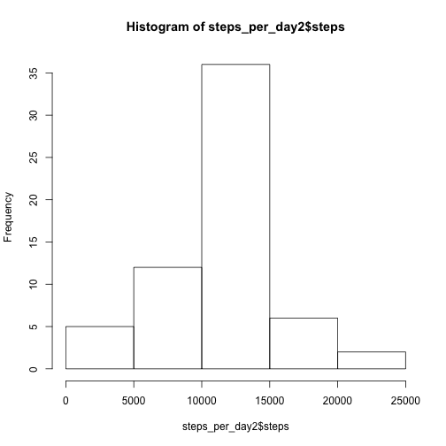
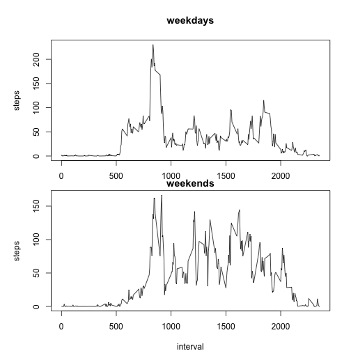

My analyze file
======================

Code for reading in the dataset


```r
dat<-read.csv("activity.csv")
```

Histogram of the total number of steps taken each day


```r
steps_per_day<-aggregate(.~date, data=dat, FUN = sum)
hist(steps_per_day$steps)
```



Mean number of steps taken each day

```r
mean(aggregate(.~date, data=dat, FUN = sum)$steps)
```

```
## [1] 10766.19
```

Median number of steps taken each day

```r
median(aggregate(.~date, data=dat, FUN = sum)$steps)
```

```
## [1] 10765
```

Time series plot of the average number of steps taken

```r
five_min_steps <- dat[,c(1,3)]
five_min_steps_mean <- aggregate(.~interval, data=five_min_steps, FUN=mean)
plot(five_min_steps_mean, type="l")
```


The 5-minute interval that, on average, contains the maximum number of steps

```r
five_min_steps_mean[which.max(five_min_steps_mean$steps),]
```

```
##     interval    steps
## 104      835 206.1698
```

Code to describe and show a strategy for imputing missing data

```r
data2<-dat
data2$meanvalue[is.na(data2$steps)] <-five_min_steps_mean$steps[which(five_min_steps_mean$interval==data2$interval[is.na(data2$steps)])]
for (i in 1:61){
  data2$steps[is.na(data2$steps)] <- five_min_steps_mean$steps[which(five_min_steps_mean$interval==data2$interval[is.na(data2$steps)])]
}
```

Histogram of the total number of steps taken each day after missing values are imputed

```r
data2<-data2[,-4]
steps_per_day2<-aggregate(.~date, data=data2, FUN = sum)
hist(steps_per_day2$steps)
```



Panel plot comparing the average number of steps taken per 5-minute interval across weekdays and weekends

```r
data2$weekday <- weekdays(as.Date(data2$date))
data2$lev <- ifelse(data2$weekday %in% c("понедельник", "вторник", "среда", "четверг", "пятница"), "weekday", "weekend")
five_min_steps2 <- data2[, c(1, 3, 5)]
five_min_steps2_mean <- aggregate(.~interval+lev, data=five_min_steps2, FUN=mean)
five_min_steps2_mean_wend<-five_min_steps2_mean[five_min_steps2_mean$lev=="weekend",]
five_min_steps2_mean_wend<-five_min_steps2_mean_wend[,-2]
five_min_steps2_mean_wday<-five_min_steps2_mean[five_min_steps2_mean$lev=="weekday",]
five_min_steps2_mean_wday<-five_min_steps2_mean_wday[,-2]
par(mfrow=c(2,1))
par(mar = c(bottom=1.5, 5.1, top=4, 2.1))
plot(five_min_steps2_mean_wday, type="l", main="weekdays")
par(mar = c(bottom=4, 5.1, top=1.5, 2.1))
plot(five_min_steps2_mean_wend, type="l", main="weekends")
```


